It's a blockchain based Full stack Exit poll system for Indian elecions.More specifically only the registered voters can come and vote.For this project we have four phases
*  Registration Phase -> Phase where users can register with their voter id card number and admin can add parties into the blockchain.
* Voting Phase -> Phase where voters can actually vote to their favourable party.
* Result Phase -> Here the result is decalred by the blockchain on the basis of  which party has recieved the maximum number of votes.
* Reset Phase -> All the blockchain data is reset phase to conduct a new election in future.
 

# All the phase changes can only be done  by the admin and other random users can not do it.

# Tech stacks used:
* React JS
* Redux Toolkit
* Node JS
* Ethers.js
* Express JS
* MongoDB

# Youtube Video for Complete Demonstration of the project
<a href="https://youtu.be/IFph8HVXUKg" target="__">Video Link</a>

# Screen shots of the Project 

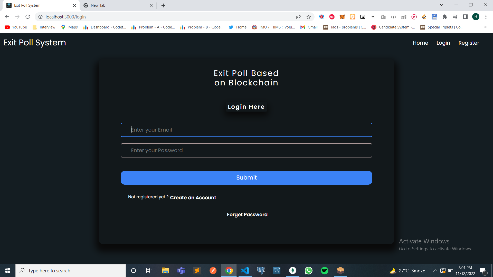
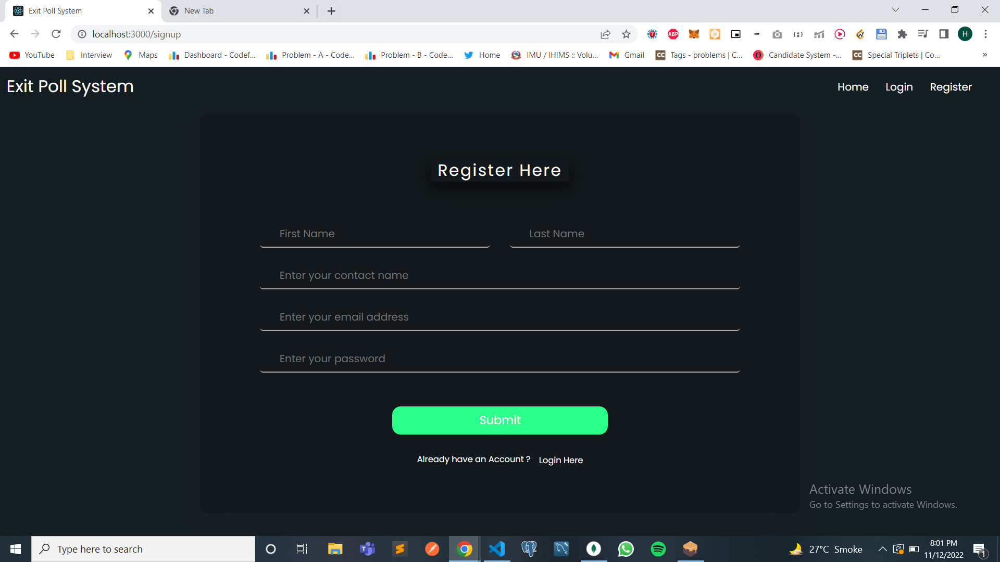
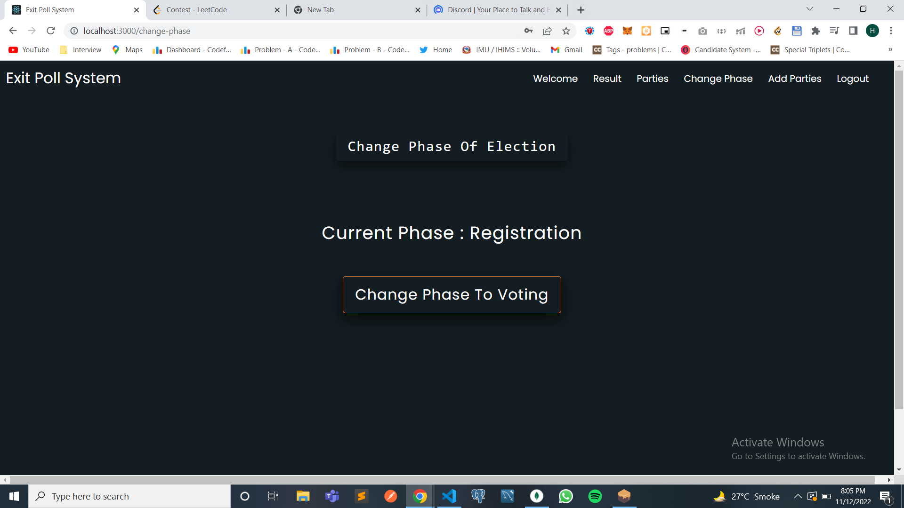
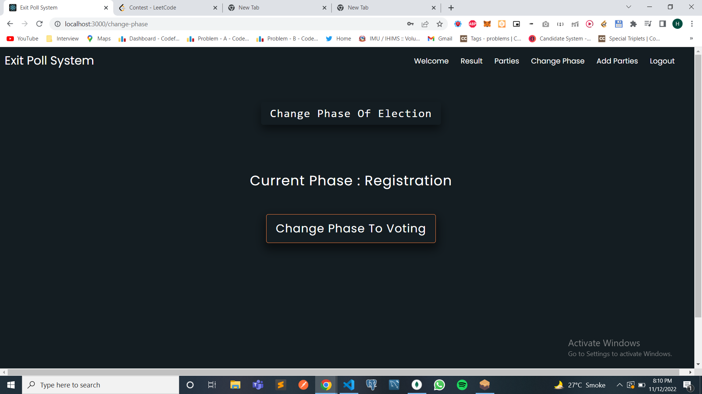
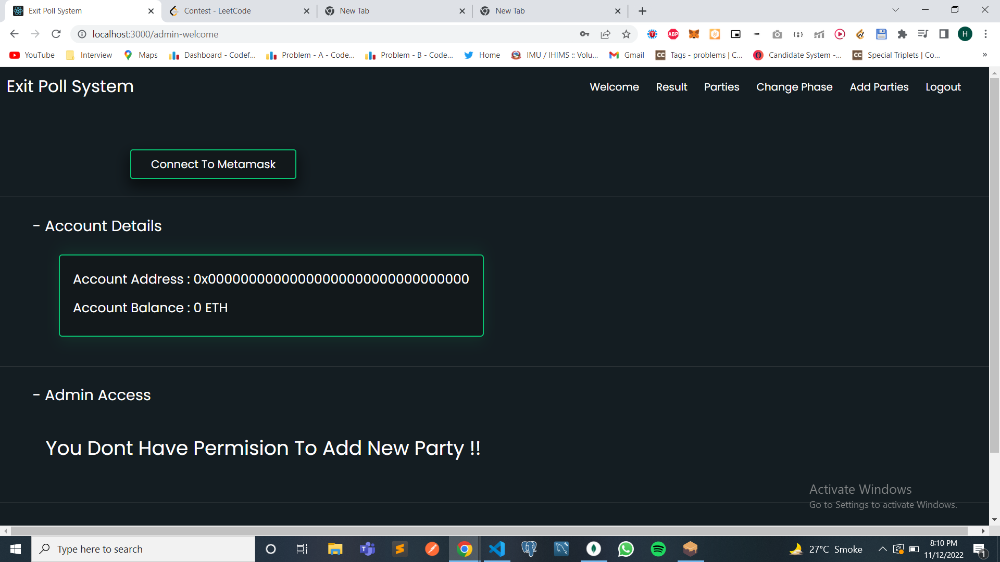
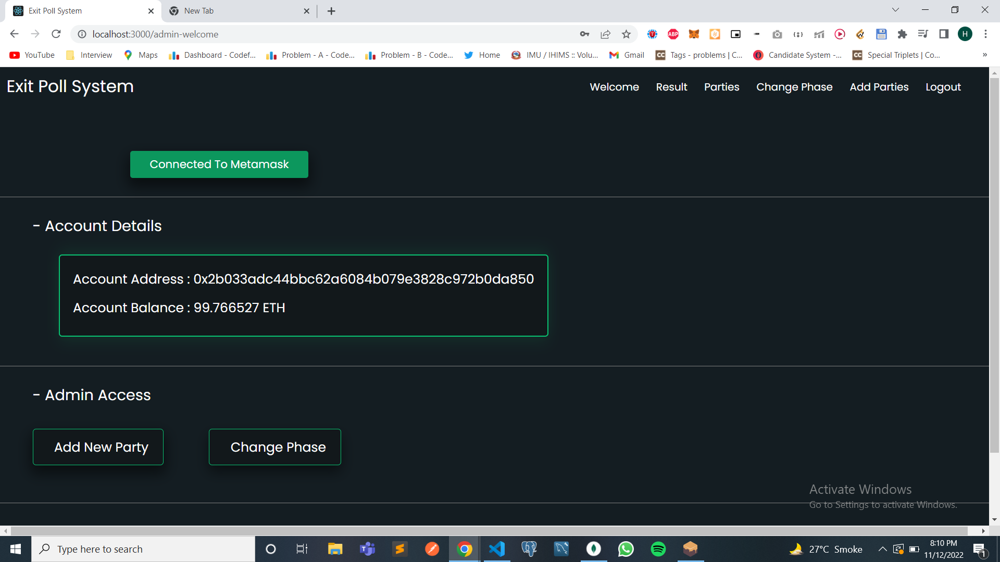

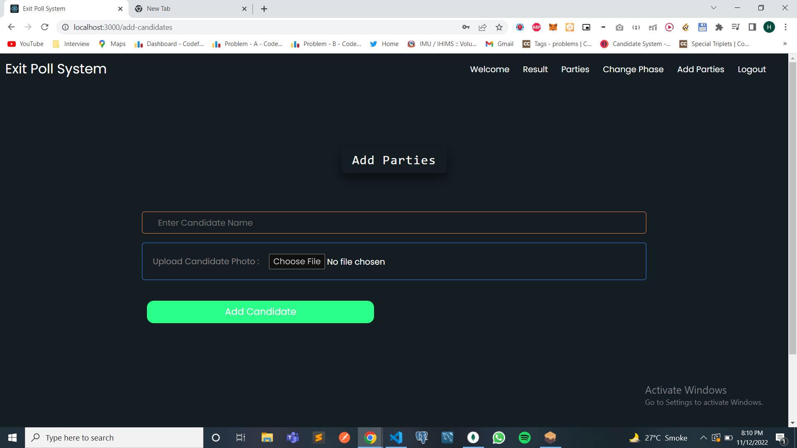
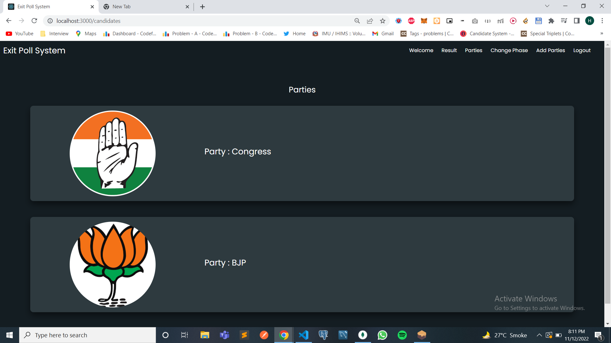
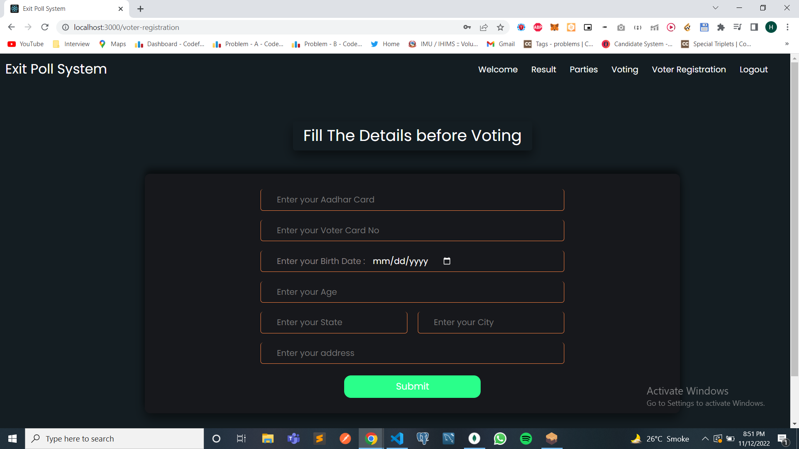
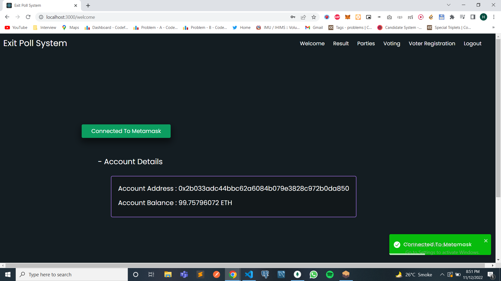
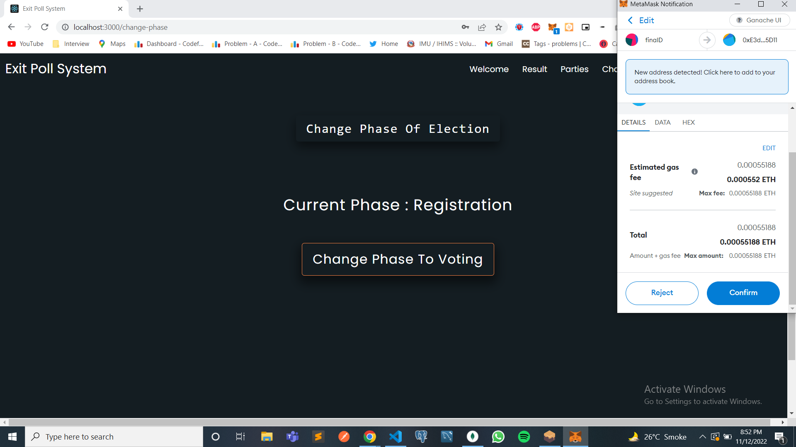
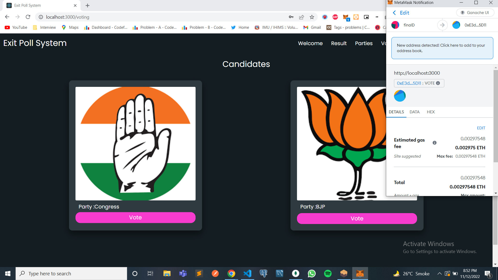
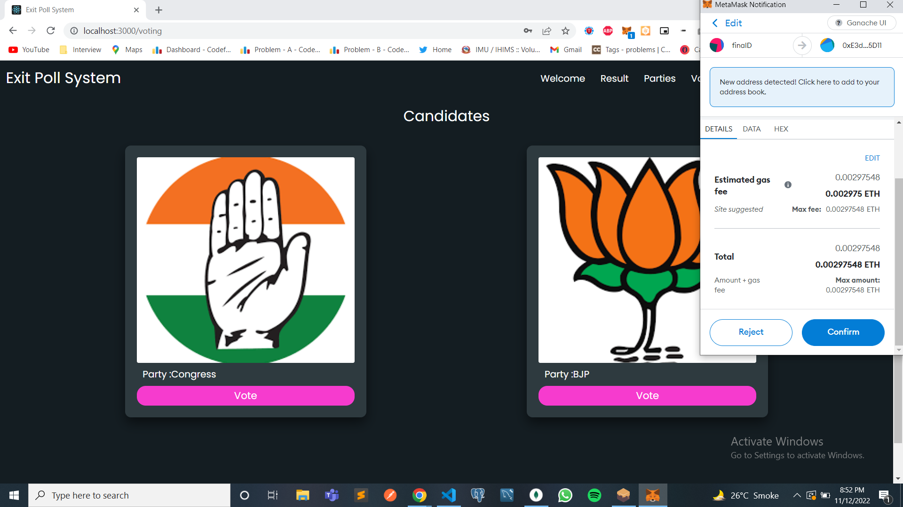
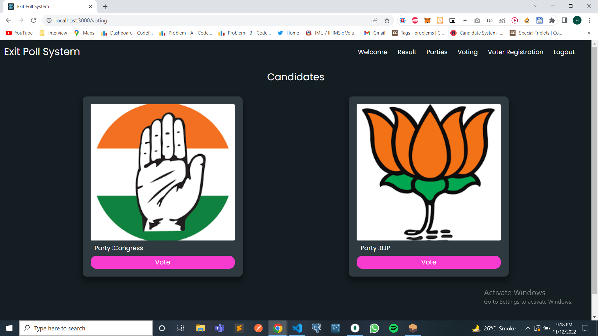
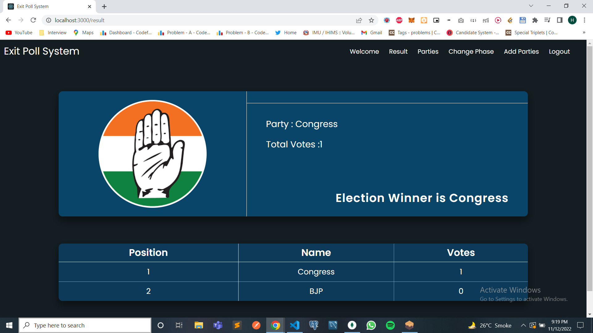

